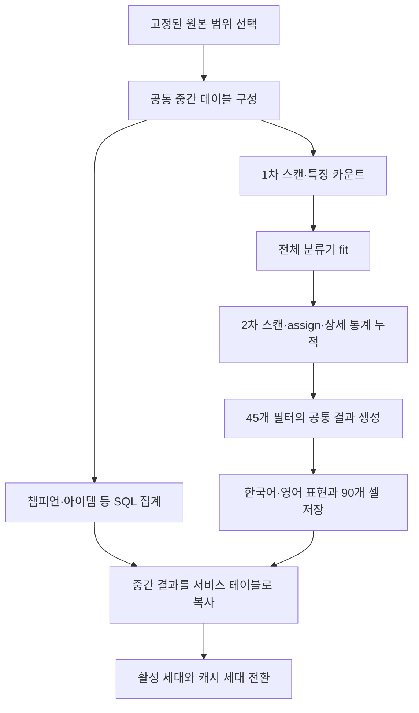

# 통계 품질을 유지하는 10분 집계 설계

## 1. 판단과 권고

**현재의 약 80분 집계를 10분 이내로 줄이려면 분류기 캐시보다 큰 구조 변경이 필요하다.** 가장 현실적인 경로는 Python API를 유지하면서, 재사용 가능한 특징을 버전별로 저장하고, 분류·누적을 작은 정수 데이터 위에서 실행하며, 결과 생성의 복사·압축 해제를 줄이고, 완성된 데이터를 다시 복사하지 않는 발행 구조로 바꾸는 것이다. 다중 프로세스와 메모리 증설은 이 구조를 뒷받침해야 한다.

최근 완료 실행의 공통 준비 시작부터 발행 로그까지는 **83.18분**이다. 이 중 조합 생성은 69.54분, 나머지 공통 준비·발행 등은 13.64분이다. 조합 내부의 DB 저장도 7.50분이므로 **준비·저장·발행을 그대로 두면 조합의 나머지 계산을 순간적으로 끝내도 약 21.14분이 남는다.** 분류기만 최적화해 10분을 달성하는 계획은 성립하지 않는다. [L1]

권장하는 목표 구조는 다음 세 가지를 함께 적용한다.

1. **계산량 감소:** 원본에서 특징을 한 번 추출하고 재사용한다. 같은 구조의 점수와 원본 문맥을 반복 계산하지 않는다. 사용하지 않을 상세 객체는 만들지 않는다.
2. **데이터 이동 감소:** 숫자·식별자 중심의 중간 표현을 사용한다. 큰 JSON의 반복 압축·해제·복사와 세대 발행 시 대량 행 복사를 줄인다.
3. **실제 병렬 실행:** 고정된 분류 결과와 원본 경계를 공유한 프로세스들이 독립 작업을 맡는다. 메모리를 충분히 확보하고 마지막 발행은 짧은 원자적 전환으로 끝낸다.

기준 83.18분을 10분으로 줄이려면 전체 경로에서 약 **8.32배의 유효 가속**이 필요하다. 작은 최적화 몇 개의 예상 절감률을 더해 이 수치를 만들 수는 없다.

**10분은 달성 가능성이 있는 설계 목표이지 현재 확보된 성능 보장이 아니다.** 약 50만 건 규모의 통상 갱신과, 4일 전체를 처음부터 복원하는 실행을 구분해야 한다. 두 경우 모두 10분을 요구한다면 더 큰 메모리·CPU와 분류 핵심 연산의 네이티브 구현까지 필요할 수 있다. 현재 M2·16GiB 호스트와 Docker 4 vCPU·7.67GiB 상태만으로는 그 목표를 약속할 근거가 없다.

이 보고서는 코드 기준 `5b629acd539030dcb05f53b73a04c43321502045`, 2026-09-12 운영 관측을 사용한다. 비용과 속도는 측정값·구조적 추론·설계 목표를 구분한다. 특정 클라우드의 벤치마크 배수를 이 서비스의 가속률로 사용하지 않는다.

## 2. 현재 시간과 측정의 한계

### 2.1 전체 시간이 확인된 기준 실행

기준 실행은 `32245fe1-f467-441a-b93f-04bbd2aa53d4`, 내부 패치 `16.18`, 한국 시간 9월 12일 06:26~07:49이다. 언어 공통 계산 및 최신 패치 전용 집계는 이미 적용됐고, 새 분류 캐시는 적용 전이다. [L1]

| 구간 | 시간 | 성격 |
|---|---:|---|
| 조합 1단계: 읽기·특징 구성 | 7.55분 | DB 스트리밍, ORM/DTO 생성, Python 전처리 포함 |
| 조합 2단계: 분류기 구성 | 13.62분 | Python `fit`, 대표 복사, 입력 해제. 이 구간 자체에 SQL 없음 |
| 조합 3단계: 분류·통계 누적 | 18.75분 | 두 번째 DB 스트리밍, 특징 구성, assign, 상세 통계 누적 |
| 조합 4단계: 결과 생성 | 22.12분 | merge/finalize/번역/검증/행 구성, 이름 override 읽기 포함 |
| 조합 5단계: DB 저장 | 7.50분 | 실행 요청·직렬화·DB 처리·대기 포함 |
| 조합 내부 setup | 약 0.01분 | 위 다섯 단계 외 준비 |
| 공통 준비·발행 등 조합 외 구간 | 13.64분 | 앞뒤 로그의 차이. 전부 DB commit 시간이라는 뜻은 아님 |
| **전체** | **83.18분** | 공통 입력 준비 시작부터 `aggregate_published`까지 |

초기 최신 패치 선택과 잠금 대기는 위 전체 시간에 포함되지 않는다. 앞으로의 10분 목표는 **집계 시작 요청부터 DB 세대 전환 및 캐시 세대 갱신 완료까지**로 정의하는 편이 명확하다. 측정 범위를 좁혀 겉으로만 10분으로 만들면 안 된다.

다른 통계 branch는 조합 branch와 병렬로 실행되므로 각 branch 시간을 전체 시간에 더하면 중복 계산이다. `write_db_seconds`도 PostgreSQL 서버에서 소비한 시간만을 뜻하지 않는다. 현재 로그로 함수별 CPU 시간, SQL 실행 시간, 네트워크 시간, 직렬화 시간을 분리할 수 없다.

### 2.2 캐시 적용 후 확인된 구간

새 실행 `bce7f6c7-e2c0-4bdd-aeb1-85ada90e6fe0`의 완료된 초기 단계는 다음과 같다. [L2]

| 항목 | 적용 전 기준 | 캐시 적용 후 |
|---|---:|---:|
| 첫 스캔 관측 수 | 472,886 | 490,448 |
| 1단계 | 453.090초 | 473.000초 |
| 2단계 | 816.991초 | 729.238초 |
| 3단계 | 1,124.779초 | 1,045.729초 |
| 2·3단계 합계 | 1,941.770초 | 1,774.967초 |

관측 합계는 166.803초, 약 8.6% 감소했다. 입력량과 서버 부하가 다르므로 순수한 변경 효과를 의미하지는 않는다. 이 표는 완료된 2·3단계 비교이며, 진행 중 전체 실행 시간을 임의로 완성하지 않는다.

분류 캐시는 `hits=19,138`, `misses=465,775`, 상한 8,192개였다. 적중률은 **3.95%**이다. 단순 LRU 확대를 다음 대규모 개선으로 삼기에는 근거가 약하다. miss는 전역 고유 덱 수가 아니다. 캐시에서 밀려난 덱의 재등장도 miss이므로, 이 수치만으로 전체 중복률이나 필요한 캐시 크기를 계산할 수 없다.

첫 스캔 수와 assign 호출 수의 차이도 누락이라고 단정하지 않는다. 현재 로직은 품질 제외·정적 데이터 미확인 관측을 별도로 처리한다. 기존의 제외·UNKNOWN 집계 규칙을 유지해야 한다.

## 3. 유지해야 할 데이터 품질 계약

속도 개선의 기본 기준은 **동일한 입력 경계·정적 데이터·분류기 버전에서 동일한 서비스 결과**이다. 다음 내용은 비용 절감을 위해 바꾸지 않는다. [L3][L4][L5]

| 보존 대상 | 구체적인 조건 |
|---|---|
| 표본 | 최신 패치, 현재 시간 범위, 티어, 유효 표본 판정, UNKNOWN 및 제외 수 |
| 분류 | family key, 투자 핵심, 미완성 판단, confidence/margin/reason |
| 통계 | 표본 수, 등수 합, 순방 수, 1등 수, 별 등급·아이템·레벨별 통계 |
| 대표 조합 | 실제 관측 근거, 대표 선정 우선순위, 동률 정렬, 완성도 판단 |
| 표시 | 24/48/72시간 × 15개 티어 부분집합 × 2개 언어의 90개 결과 |
| 상세 | 현재 제공하는 변형·빌드·캐리 정보, 레벨별 상위 결과, 언어별 이름과 툴팁 |
| 발행 | 목록과 상세가 같은 세대를 사용하고 실패 시 이전 세대를 계속 제공 |

같은 분류 signature라도 아이템 조합·placement·시간·티어가 다를 수 있다. **분류 결과를 재사용하는 것과 개별 관측을 통계에서 제거하는 것은 다른 변경이다.** 특징 ID로 묶어 분류하더라도 각 관측의 모든 통계 기여는 계속 반영해야 한다.

클러스터 수를 강제로 줄이기, 적은 표본 삭제, 최근 24시간만 학습, 후보 수·대표 수를 임의로 줄이기, 모델을 오래 고정하기는 출력이 달라질 수 있다. 이 보고서의 기본 권고에 포함하지 않는다.

## 4. 병목을 만드는 현재 구조



현재 언어별 `finalize` 중복은 제거됐다. 그러나 동일한 참가자 원본을 두 번 읽으며 DTO와 특징을 다시 만들고, 필터별 누적기 merge가 큰 사전 구조를 반복 순회한다. 이후 압축된 상세를 펼쳐 정렬하고, 전체 JSON을 복사해 언어 표현을 붙인 뒤 DB에 두 언어 결과를 저장한다. [L3][L5]

SQL 통계에는 이미 변경 시간 버킷을 재계산하는 구조가 있다. **모든 SQL 통계를 무조건 전량 재계산한다고 설명하면 부정확하다.** 다만 변경 버킷이 넓거나 원본 파생 필드가 수정되면 재처리 범위가 커지고, 그 버킷의 기존 관측 전체를 다시 펼친다. 조합 artifact branch는 최신 패치의 학습 범위를 매번 다시 읽고 계산한다. [L6]

현재 `AggregateBuildContext`의 ID 상한은 신규 행의 유입 경계를 제한하지만, 그 자체로 기존 행의 모든 갱신을 동결하는 MVCC snapshot은 아니다. 특징 재사용·병렬화 때는 `source_max`만 공유할 것이 아니라 어떤 원본 버전과 카탈로그 버전을 읽었는지도 명시해야 한다. 현재 통계 규칙을 유지하면서 입력 재현성을 강화할 지점이다.

## 5. 분류기 구성의 계산량 감소

### 5.1 구조 유사도에 필요한 표현만 사전 계산

`_structural_similarity`는 기물 겹침과 특성 Jaccard만 사용한다. 이 함수의 캐시 키에 별 등급·투자·표본 수 등 전체 `BoardSignature`를 넣을 필요는 없다. `(units_id, traits_id)` 구조 ID 쌍으로 같은 값을 재사용할 수 있다. 이 함수는 대칭이므로 쌍의 순서를 정규화할 수 있지만, 방향성이 있는 다른 점수까지 같은 방식으로 처리하면 안 된다. [L4]

기물·특성 문자열을 실행 범위의 안정적인 정수 ID로 변환하고 집합을 정수 비트셋으로 표현하는 방안이 유력하다. 교집합 개수는 `(left_mask & right_mask).bit_count()`, 합집합 개수는 `(left_mask | right_mask).bit_count()`로 계산한다. 현재 분모와 가중치·부동소수점 계산 순서를 그대로 유지하면 집합 의미를 보존할 수 있다. 이 가속률은 아직 측정하지 않았다.

점수 캐시는 **실제로 조회한 이웃 쌍만** 보관한다. 전수 `N × N` 행렬은 만들지 않는다. 캐시 hit가 낮으면 메모리만 커지므로 root별 임시 점수 배열처럼 수명이 짧은 구조가 더 적절할 수 있다.

### 5.2 동일 후보 점수를 두 번 계산하지 않기

현재 `fit()`은 구조 점수로 `matched`를 만든 뒤 `max()`에서 같은 덱·root 점수를 다시 계산한다. 후보 평가를 `(root_id, structural_score, family_score)` 기록으로 만들어 조건 판단과 최종 선택에 공유한다. 원래는 필요하지 않았던 후보의 `family_score`까지 모두 계산하면 오히려 손해이므로 구조 조건 통과 후 계산한다.

정렬의 tie-break와 원래 후보 순서는 유지한다. 현재 코드의 후보 상한 32·64·96 등을 확대하거나 축소하지 않고, 같은 후보 집합의 계산 횟수만 줄이는 변경이다.

### 5.3 원본 문맥과 투자 모드를 반복 생성하지 않기

`fit()`은 원본 덱을 주력 특성·단계별로 묶고, 뒤에서 비슷한 `context_index`를 다시 만든다. 동일 키와 구성임을 확인한 뒤 하나의 읽기 전용 인덱스를 공유할 수 있다. 원본 특징별 주력 특성, 단계, canonical 정렬 키, 관측 투자 모드도 한 번 계산해 둔다.

단, `_primary_axis_context()`는 root의 `focus_units`와 필터링된 관측 집합에 의존한다. 같은 특성을 가진다고 결과를 무조건 공유하면 서로 다른 캐리의 근거를 섞는다. 재사용 키에는 원본 문맥 ID와 적용된 root 조건을 포함하거나, 필터 결과를 바꾸지 않는 기초 pair-support까지만 공유한다.

### 5.4 대표 관측 선정과 병합의 평가 중복 제거

`_cluster_medoid()`는 최대 32개 대표 후보를 해당 그룹의 모든 적격 구성원과 비교한다. 후보-구성원 점수의 반복 호출·집합 변환을 없애고, 정수 배열로 점수를 일괄 계산하는 경로가 적합하다. 후보 수를 줄여 빠르게 만드는 방식은 제외한다.

최종 family 병합에는 처리 순서에 따라 누적 그룹이 달라질 수 있는 순차 의존성이 있다. 이 단계 전체를 독립 조각으로 나눠 합치는 방식보다 **후보 점수와 지지 근거 계산을 병렬로 하고 기존 순서로 병합을 결정하는 방식**이 안전하다.

함수별 점유 시간은 아직 없다. 어느 한 함수를 10배 빠르게 하면 전체 `fit`도 10배가 된다는 가정은 하지 않는다. 위 네 개선은 독립적으로 적용·측정할 수 있는 구체적인 후보들이다.

## 6. 특징 저장과 분류 결과 재사용의 확대

### 6.1 두 번의 원본 스캔을 한 번의 특징 입력으로 바꾸기

현재 두 스캔 모두 `select(MatchPlayer)`로 ORM 객체를 만들고, 유닛·특성 DTO와 normalized signature를 구성한다. 먼저 필요한 열만 읽는 Core/컬럼 projection으로 전환할 수 있다. SQLAlchemy도 ORM 객체 생성 비용과 DB fetch 비용을 구분하며, 필요한 열만 조회하는 경로를 설명한다. [S1]

더 큰 개선은 다음 중간 형식을 한 번 만드는 것이다.

| 레코드 | 내용 | 재사용 범위 |
|---|---|---|
| 분류 특징 사전 | signature ID, 전체 분류 특징, canonical key | 동일 feature schema·정적 데이터 범위 |
| 관측 레코드 | player ID, signature ID, 등수·티어·시각·레벨, 상세 통계에 필요한 아이템/유닛 참조 | 원본 revision까지 동일할 때 |
| 가중 특징 카운트 | 학습 시간 범위에서 signature별 표본 수 | 집계 세대의 시간 경계 |
| 분류 결과 | signature ID → family·confidence·margin·incomplete·reason | 같은 frozen classifier digest |

이를 Arrow IPC 또는 정수 열 중심의 파일로 만들어 1단계 이후 다시 DB를 읽지 않고 재사용할 수 있다. Arrow의 memory mapping은 적합한 버퍼의 복사를 줄일 수 있지만, 이미 Python dict로 변환하면 객체 생성 비용이 다시 발생한다. 입력 변환·파일 쓰기·읽기 비용도 전체 시간에 포함해야 한다. [S2]

### 6.2 LRU보다 확실한 중복 제거

분류기에 입력할 전체 고유 signature 목록을 만들고 **각 signature를 한 번만 `assign()`한 뒤 모든 관측이 결과를 참조**하도록 설계할 수 있다. 이렇게 하면 LRU eviction으로 같은 구성에 재계산하는 문제가 없다. 단, 전체 고유 signature 수와 분류 결과 사전 크기를 먼저 알아야 한다.

전체 보드를 RAM에 유지하는 대신 고유 특징은 정수 ID/배열, 관측은 메모리 매핑 파일로 둔다. 파티션별 중복 제거 후 전역 동일 키를 통합할 수도 있다. 이 변경은 3단계의 분류 비용만 줄인다. 모든 아이템·별 등급·순위 통계를 계속 누적해야 하므로 3단계 전체를 고유 signature 수로 축소할 수는 없다.

### 6.3 영구 특징의 무효화 조건

영구 특징 저장의 최소 identity는 `(원본 ID, 원본 feature revision, 패치, alias/catalog digest, quality rule, feature schema)`다. 데이터가 바뀌면 해당 특징을 재생성한다. 이름 번역만 바뀐 경우 분류 특징은 재사용하고 표현만 다시 만들 수 있도록 분류 카탈로그와 표시 카탈로그의 버전을 분리하는 것이 좋다.

관측의 시간·placement를 제외한 signature만 남기는 것으로는 상세 통계를 복구할 수 없다. feature와 observation을 분리하되 둘 다 보존한다. 메모리 절약을 위해 원본의 유효한 통계 차원을 버리는 방식은 채택하지 않는다.

## 7. 정확한 증분 집계와 적용 범위

### 7.1 안전하게 증분화할 수 있는 것

새로 들어온 관측만 특징을 계산하고, 갱신된 관측은 이전 기여를 제거한 뒤 새 기여를 넣는다. 4일 학습 범위 및 24/48/72시간 표시 범위에서 빠져나간 관측도 같은 방식으로 제거한다. 원본 수정, 지연 유입, 패치 전환, 카탈로그 변경을 각각 처리해야 한다.

개수·등수 합·순방 수·1등 수는 정수 합계이므로 증분화하기 쉽다. 반면 최댓값 대표·상위 빌드·metadata tie-break는 현재 1등 후보가 만료되면 다음 후보를 찾아야 한다. **최종 top 10만 저장해 두고 나머지 근거를 버리면 정확한 재계산을 할 수 없다.** 모든 후보의 충분통계나 해당 버킷을 재생성할 수 있는 관측 참조가 필요하다.

### 7.2 분류기 재구성은 별도 문제

새로운 덱들이 들어오면 `fit()`의 후보 지지율·대표·병합 결과가 바뀔 수 있다. 따라서 **분류기가 바뀌었는데 기존 덱의 family 배정을 그대로 유지하는 증분화는 현재 전량 계산과 같지 않다.** 신규 데이터만 분류하고 기존 데이터의 배정을 고정하는 설계는 기본 권고에서 제외한다.

안전한 접근은 다음과 같다.

1. 특징 자체는 재사용한다.
2. 기존 알고리즘으로 현재 전체 학습 범위의 classifier를 구성한다.
3. prototype뿐 아니라 threshold·후보 인덱스·정렬 규칙·분류 버전을 포함한 digest가 동일하면 이전 assignment를 재사용한다.
4. digest가 바뀌면 모든 고유 signature를 현재 classifier에 다시 배정한다.
5. family 이동과 만료를 반영해 정확한 충분통계를 갱신하거나 고유 특징/관측의 경량 입력에서 다시 누적한다.

분류기의 일부 변경만으로 영향받을 덱을 선별하는 기법은 추가 단계다. 후보 집합 변화가 confidence·margin·UNKNOWN 판정을 바꿀 수 있으므로 현재 최고 점수의 family만 비교해서는 안 된다.

### 7.3 시간 버킷의 정확성

현재 cutoff는 집계 시각 기준의 연속 시간이다. 24시간을 단순히 정시 버킷 24개로 대체하면 경계 표본이 달라진다. 내부 버킷은 활용하되 첫·마지막 경계 버킷은 관측 시각으로 정확히 필터링하거나 더 세밀한 기여를 보존한다. 반올림된 비율을 합치지 않고 정수 원시 합계를 합친 뒤 마지막에 현재와 같은 반올림을 적용한다.

### 7.4 변경 감지의 세분화

현재 SQL 버킷 판정은 공통 `updated_at`을 사용한다. collector의 legacy archetype/carry 갱신도 이 값을 바꾼다. 이미 SQL은 값이 실제로 달라질 때만 UPDATE하므로 단순히 “조건부 UPDATE를 넣자”는 제안은 중복이다. 추가 개선은 필드별 의존성에 따라 원본 특징·조합 분류·아이템 통계 revision을 분리하는 것이다. 어떤 통계가 무엇에 의존하는지 확인하지 않고 갱신 조건을 좁히면 누락이 생긴다. [L4][L6]

## 8. 결과 생성과 상세 데이터 비용 감소

### 8.1 탈락 후보는 큰 객체로 만들지 않기

현재 `_VariationState.add()`는 모든 관측을 `_compact_row()`로 깊게 복사하고 `_row_rank()`에서 유닛 JSON까지 만든 뒤 대표가 될지 비교한다. 먼저 `(완성 여부, 레벨, 시각, player ID)`를 비교하고, 동률일 때만 기존 JSON tie-break를 계산한다. 대표가 바뀔 때만 compact payload와 압축 blob을 만든다. 등수 합과 아이템 누적은 별개로 모든 관측에 적용한다. [L5]

`_metadata_rank()`의 정렬 JSON·SHA 계산도 동일한 불변 metadata에만 재사용한다. 같은 champion ID라도 metadata revision이 다르면 동일 데이터로 보지 않는다. 문자열을 bytes로 바꾸는 과정에서 canonical key가 달라지면 family identity나 대표 선정에 영향을 줄 수 있다.

### 8.2 최종 상위 10개만 펼치기

`level_board_payloads()`는 표본 기준을 통과한 모든 압축 blob을 풀고 payload를 만든 뒤 정렬해서 10개를 반환한다. 순위는 confidence·평균 등수·표본 수·board key로 결정된다. 이 값들을 작은 충분통계에서 계산해 상위 10개를 고르고, 선택된 blob만 풀면 결과를 유지하면서 비용을 줄일 수 있다.

현재와 동일하게 confidence와 평균을 반올림한 값으로 비교해야 한다. 반올림 전 값을 비교하면 동률 순위가 바뀔 수 있다. 후보가 10개를 넘는 데이터에 대해 기존 정렬 결과와 비교하는 테스트가 필요하다.

### 8.3 누적기 merge 재사용

현재 3개 시간 범위 × 15개 티어 부분집합마다 누적기를 합친다. 티어별 누적 시간 창을 먼저 만들고 이를 재사용하거나, 추가 티어만 더하는 부분집합 계산을 검토할 수 있다.

다만 `merge`가 단순 숫자 합계뿐 아니라 대표·metadata·변형을 포함한다. 공유 객체를 이후 수정하거나, 입력 순서에 민감한 동률 대표를 바꾸지 않도록 immutable 충분통계와 deterministic merge가 전제되어야 한다. 역연산이 없는 대표 선정에 단순 prefix subtraction을 적용하지 않는다.

### 8.4 번역 데이터와 통계 데이터의 저장 분리

같은 챔피언·아이템 이름·툴팁·효과가 수천 개 상세 JSON에 중복된다. 통계 부분은 neutral artifact로 저장하고 정적 표현은 `(catalog version, locale, kind, ID)`로 공유하는 설계가 가능하다. API는 여전히 현재 형태를 반환할 수 있다.

두 가지 전달 방식이 있다. 첫째, 배치에서 완성된 언어별 응답 bytes를 미리 만들어 DB/blob 저장소에 저장한다. 요청은 해당 bytes를 읽기만 한다. 둘째, 요청 시 작은 정적 테이블을 붙인다. 두 번째는 통계 재계산은 아니지만 요청 작업이 증가하므로, 현재의 빠른 읽기 요구에는 **첫 번째를 우선**한다. 목록과 상세는 각각 별도 객체로 저장해 상세를 열기 전 목록에 상세 전체가 포함되지 않게 한다.

검증을 없애서 시간을 줄이는 방향은 권고하지 않는다. 같은 정적 엔티티에 대한 중복 검증을 공유하고, 표본 합계·세대·filter key·상세 완결성은 계속 확인한다.

## 9. 병렬화 설계

현재 `ParallelAggregateRunner`는 서로 다른 통계 branch를 비동기로 겹쳐 실행한다. **조합 Python 루프를 여러 CPU 코어로 분할하는 구조는 아니다.** 일반 CPython에서 CPU 계산을 나누려면 별도 프로세스 또는 GIL을 벗어나는 네이티브 구간이 필요하다. `ProcessPoolExecutor`는 가능하지만 인자와 결과의 직렬화 제약이 있다. [S3]

| 분할 단위 | 적합성 | 보존 조건 |
|---|---|---|
| 원본 특징 생성 chunk | 높음 | 동일 카탈로그·원본 revision·필터 |
| 고정 classifier의 signature 배정 | 높음 | 모든 프로세스에 동일 prototype·index·threshold |
| family별 관측 누적·상세 생성 | 높음 | 한 family의 관측을 같은 소유자에게 전달, 전역 분모는 공통 |
| 45개 필터 셀 생성 | 중간 | 큰 누적기를 매 작업에 복사하지 않기 |
| fit의 점수 행렬 일부·이웃 평가 | 중간 | 후보 집합·정렬·동률·부동소수점 순서 유지 |
| fit 전체를 조각별로 수행해 family 합치기 | 낮음 | 현재 전역 근거와 다르므로 기본안에서 제외 |
| 언어별 전체 통계 계산 | 부적합 | 이미 제거한 중복을 되살림 |

권장 구조는 한 coordinator, 고정된 특징 파일, 읽기 전용 classifier, family를 소유하는 계산 worker, 제한된 DB writer다. 프로세스 간 거대한 Python 사전을 매번 pickle하지 않는다. Arrow/NumPy의 읽기 전용 버퍼나 memory mapping을 활용하고 작업당 수천 개 이상의 관측을 묶어 전달한다. [S2][S3]

현재 약 2.78GiB인 worker 전체를 단순히 4개 복제하면 그것만으로 약 11.1GiB다. DB·OS·API·부모 프로세스·임시 배열도 필요하므로 현재 7.67GiB VM에서 즉시 4프로세스를 켜는 것은 적절하지 않다. 이 수치는 복제 방식의 위험을 설명하는 계산이며, 공유 버퍼를 사용한 설계의 실제 메모리 측정값은 아니다.

`fit`가 끝날 때까지 assignment는 기다려야 하고, family 통계가 완성돼야 final output을 만들 수 있다. 이런 선행 관계 때문에 프로세스 8개가 곧 8배 가속을 뜻하지 않는다. 독립 worker의 내부 BLAS/Polars thread 수까지 합쳐 CPU를 과다 할당하지 않아야 한다. Polars를 쓰는 경우 다중 프로세스와 fork의 상호작용도 공식 지침을 따른다. [S4]

## 10. PostgreSQL과 발행 구조

### 10.1 확인된 저장 부담

관측 시 `comp_family_detail_artifacts`의 전체 관계 크기는 약 **7.07GiB**, summary는 약 **0.62GiB**였다. 이는 테이블·인덱스·TOAST 등 전체 관계 크기이며, 한 배치의 논리 JSON 크기나 순수 신규 쓰기량이 아니다. 행 수 추정과 크기를 나눠 실제 평균 응답 크기라고 해석해서도 안 된다. [L1]

세 artifact 테이블에는 lookup B-tree와 UNIQUE B-tree가 동일한 열 순서를 사용하는 중복이 확인됐다. UNIQUE 인덱스의 계약을 유지하면서 불필요한 비고유 lookup 인덱스를 정리할 후보가 있다. 인덱스 비용은 줄지만 큰 JSON payload의 비용까지 없어지지는 않는다.

### 10.2 INSERT 경로와 COPY

현재 artifact 저장은 셀별 `session.execute(insert(...), rows)`다. 이미 묶음 INSERT와 transaction을 사용하므로, 이를 “행마다 commit하는 코드”라고 보면 안 된다. COPY는 더 큰 묶음을 이진 프로토콜로 전달하는 대안이며 asyncpg가 `copy_records_to_table()`을 제공한다. [S5][S6]

COPY 적용 시 JSONB codec, NULL, timestamp, transaction 소유권, connection pool 경계를 정확히 연결해야 한다. 별도 connection에 잘못 쓰면 기존 atomic publication을 깨뜨릴 수 있다. 효과는 Python 직렬화와 서버 쓰기 중 어느 쪽이 큰지에 따라 달라진다. 먼저 쓰는 bytes 자체를 줄이고, 그다음 전송 방식을 개선하는 순서가 유리하다.

### 10.3 서비스 테이블로 다시 복사하는 발행 제거

`apply_staged_unit_aggregates()`는 중간 결과 건수를 확인하고 영향받은 서비스 버킷을 삭제한 뒤 결과를 INSERT SELECT로 복사한다. 이 후반 구간이 앞의 계산을 빠르게 해도 남는다. [L6]

대안은 **완성된 세대/버킷 결과를 그대로 서비스 대상으로 삼고 manifest의 참조만 전환**하는 구조다. 모든 버킷을 매번 복사하는 full generation 방식은 저장량을 늘릴 수 있으므로, 변경되지 않은 버킷은 기존 결과를 참조하고 변경 버킷만 새 object ID로 연결하는 방식이 더 적합하다.

모든 API 쿼리에 같은 generation/manifest 경계를 적용하고, 목록·상세·메타 필터·페이지 cursor가 동일 세대를 보도록 바꿔야 한다. 변경 범위가 크지만 전체 집계를 10분으로 줄이기 위해 필요한 주요 후보이다. 쓰기 부하를 백그라운드로 미루는 경우에도 사용자에게 완전한 통계가 보이기 전까지는 완료로 계산하지 않는다.

오래된 세대 정리는 새 세대 발행 경로에서 분리할 수 있다. 현재 유효한 cursor가 참조하는 세대는 유지하고, 참조가 끝난 세대만 정리한다. PostgreSQL 파티셔닝은 보존 기간이 지난 큰 데이터 묶음을 관리하는 대안이지만, attach/detach와 잠금·검증 조건을 고려해야 한다. [S7]

### 10.4 메모리·쿼리 설정

관측된 PostgreSQL은 17.10이며 `shared_buffers=128MiB`, 기본 `work_mem=4MiB`, `max_wal_size=1GiB`였다. **배치 코드는 별도로 `work_mem=64MiB`를 설정한다.** 기본 4MiB만 보고 집계도 4MiB라고 설명하면 잘못이다. `work_mem`은 connection 전체의 고정 상한이 아니라 정렬·해시 작업별로 사용되고 병렬 worker와 동시 쿼리에 따라 합산된다. [S8]

`pg_stat_database.temp_bytes`는 약 182GiB 누적이었다. 통계 시작 시점이 명확하지 않으므로 한 배치가 그만큼 spill했다는 뜻은 아니다. `track_io_timing=off`이므로 read/write time이 0인 것도 디스크 비용이 없다는 뜻이 아니다. [L1]

메모리 증설 후에는 배치 세션의 64→128MiB 같은 제한된 조정과 DB buffer/WAL checkpoint 설정을 검토할 수 있다. 현재 VM 여유가 적은 상태에서 모든 세션을 일괄 증설하지 않는다. 실측 temp/WAL 증가량을 보고 조정해야 한다. [S8]

### 10.5 DB 코어만 늘리면 해결되지 않는 이유

PostgreSQL 17은 일반적으로 데이터를 쓰는 쿼리에 parallel plan을 만들지 않는다. 현재의 많은 `INSERT INTO ... SELECT ...`는 `max_parallel_workers_per_gather`만 늘려 가속되리라 기대할 수 없다. `CREATE TABLE AS` 등은 예외가 있지만 테이블 수명·build isolation·후속 인덱스 비용까지 바뀐다. [S9]

실제 대안은 독립 버킷/branch를 별도 connection으로 분할하거나, 읽기·계산·쓰기 구조를 바꾸는 것이다. DB 병렬성은 CPU뿐 아니라 디스크 대역폭과 메모리도 함께 사용하므로 높은 동시성이 항상 유리하지 않다.

## 11. 자원 증설의 효과와 한계

### 11.1 이번 관측

| 항목 | 확인된 값 | 해석 |
|---|---:|---|
| 호스트 | Apple M2, 16GiB, 성능 코어 4 + 효율 코어 4 | 8개가 모두 같은 성능의 코어는 아님 |
| Docker VM | 4 vCPU, 약 7.67GiB | 컨테이너 전체가 공유하는 자원 |
| 집계 worker | CPU 약 100.5%, 메모리 약 2.78GiB | 그 순간 코어 하나 분량 CPU 사용 |
| macOS swap 사용 | 약 1.33GiB | VM 내부 swap과 별도 층 |
| VM MemAvailable | 약 176.8MiB | 당시 여유가 적음 |
| VM swap | 약 1GiB 중 거의 전부 사용 | 추가 병렬화 전 메모리 설계 필요 |
| 10초 VM swap 변화 | page-in 2, page-out 1, major fault 375 | 그 구간의 활발한 swap 폭증은 확인되지 않음 |

컨테이너 메모리 사용량 합계만으로 VM 메모리 압력을 판단할 수 없다. Linux VM과 macOS 모두 별도 상태를 보아야 한다. 이 VM에서는 `/proc/pressure/memory`를 제공하지 않아 PSI stall 비율을 얻지 못했다. major fault 전부를 swap으로 해석하지 않는다. [L1][S10]

### 11.2 선택지

| 선택지 | 기대 역할 | 10분 목표 판단 |
|---|---|---|
| 현재 Docker 4→6 vCPU | 병렬 worker 및 DB 경쟁 완화 | 현재 단일 Python 루프만으로는 부족 |
| 현재 Docker RAM 8→10~12GiB | working set·정렬·버퍼 여유 | 호스트가 16GiB이므로 macOS 압력을 함께 확인해야 함 |
| 32GiB 이상 호스트 | 2~4개 worker와 DB에 여유 | 구조 변경과 결합할 중간 선택 |
| 별도 Linux 배치 서버, 8~16 vCPU·32~64GiB·NVMe | 지속 CPU 성능, 실제 병렬 실행, VM/개발환경 경쟁 제거 | 10분 설계의 권장 시험 범위. 아직 필요한 최소 사양 확정 아님 |
| DB까지 같은 서버 또는 가까운 사설망에 배치 | 큰 원본·결과 전송 비용 감소 | 원격 왕복과 bytes가 큰 경우 유리 |
| 배치만 원격, DB는 집의 Mac | API 유지와 계산 분리 | 원본을 매번 WAN으로 두 번 읽으면 이득 상쇄 가능 |

10분을 목표로 별도 서버를 쓴다면, 원본 전체를 반복 전송하지 말고 버전된 특징/변경분을 가까운 저장소에 유지한다. API·Riot 수집은 기존 Python 서비스로 두어도 된다. CPU 제조사·ARM/x86별 속도는 이 classifier와 같은 작업으로 비교해야 한다.

클라우드 예로 AWS C8g는 compute 계열 ARM 선택지지만, 명목 vCPU 수나 공급자 성능 문구를 이 코드의 가속 배수로 사용할 수 없다. 32~64GiB 메모리를 맞추려면 CPU/메모리 비율도 함께 비교해야 한다. 실제 구매 전에는 리전·시간제/상시·디스크·전송 비용을 포함한 견적이 필요하다. [S11]

현재 worker는 완료 후 900초를 쉰다. 배치가 10분이 되면 다음 시작까지 주기는 약 25분이며, 계산 시간 비율은 약 40%다. 고정 15분 주기로 바꾸면 부하와 데이터 신선도가 달라진다. 요금 계산도 “항상 켜 둔 서버”와 “작업 때만 쓰는 서버”를 구분해야 한다.

## 12. 도구·언어 선택

| 도구 | 이 프로젝트에서 적합한 부분 | 한계·우선 판단 |
|---|---|---|
| Python + 정수 비트셋/사전 계산 | 기물·특성 겹침, canonical key, 반복 특징 | 가장 작은 변경으로 시작 가능. 분류 규칙 유지 |
| ProcessPoolExecutor | 고정 classifier 배정, family별 렌더링 | 프로세스당 메모리·pickle·초기화 비용 관리 필요 [S3] |
| Arrow IPC / memory map | 특징 파일, worker 간 읽기 전용 입력 | dict로 되돌리면 zero-copy 이점 감소 [S2] |
| Polars | 정형 관측의 group-by·join·filter·정수 합계 | 복잡한 Python UDF를 그대로 넣으면 이점 제한. 일부 연산은 streaming 적용 여부 확인 [S12] |
| DuckDB | 로컬 columnar 입력의 SQL 집계와 탐색 | 최종 PostgreSQL 저장은 남음. thread·메모리·spill 계획 필요 [S13] |
| Rust + PyO3 | 구조 점수·mode 비교·medoid 거리 계산 kernel | Python 객체 왕복 대신 배열 단위 호출. 동일 부동소수점·정렬 의미 유지 [S14] |
| Cython | 기존 계산 루프를 typed native loop로 이동 | `nogil`만 붙여 자동 가속되는 것은 아님 [S15] |
| orjson | 최종 응답/저장 직렬화 | canonical identity JSON 전역 교체는 제외. GIL 유지하므로 자체가 병렬화 해결책은 아님 [S16] |
| asyncpg COPY | 대량 결과 전송 | bytes 자체·JSONB 저장·인덱스 비용은 별도 [S6] |
| free-threaded Python | 객체 중심 다중 thread의 장기 후보 | 확장 호환성·GIL 재활성화·메모리·경합 확인 필요. 현재 3.12에서 단순 설정 변경으로 적용 불가 [S17] |
| Ray | 여러 머신의 작업·객체·실패 관리 | 한 머신 2~4 worker에는 복잡도가 클 수 있음. 공유 배열과 일반 dict의 복사 특성이 다름 [S18] |
| GPU / Numba | 정형화된 대량 수치 kernel 후보 | 현재 문자열·집합·분기·JSON 전체를 자동 가속하지 못함. 우선순위 낮음 |
| Spark / 분산 OLAP DB | 훨씬 큰 정형 데이터와 다중 서비스 분석 | 현재 custom classifier와 무거운 payload 문제가 그대로 남을 수 있음 |
| 전체 Spring Boot 전환 | 전체 재구현 | 현재 API 병목 해결책이 아니며 변경 범위가 지나치게 큼 |

**권장 조합은 Python orchestration + 정수 특징/Arrow + 제한된 다중 프로세스 + 필요 시 Rust/Cython kernel + PostgreSQL 발행 개선이다.** Polars와 DuckDB는 둘 다 처음부터 도입하지 않고, 정형 충분통계 구간에 더 적은 변환으로 맞는 하나를 선택한다.

## 13. 10분 가능성의 수치 모델

### 13.1 코어 증가만의 낙관적 한계

기준 83.18분에서 조합 외 13.64분과 artifact 저장 7.50분을 고정한다고 가정하면 다음과 같다.

```text
남는 고정 구간 = 21.14분
가속한다고 가정한 조합 나머지 = 62.04분
예상 하한 = 21.14 + 62.04 / 유효 가속 배수
```

| 조합 나머지의 가속 배수 | 계산상 전체 시간 |
|---:|---:|
| 2배 | 52.16분 |
| 4배 | 36.65분 |
| 6배 | 31.48분 |
| 8배 | 28.89분 |
| 16배 | 25.02분 |
| 무한대 | 21.14분 |

이 표는 CPU 개수별 예측이 아니다. I/O가 섞인 구간까지 이상적으로 가속한다고 놓은 낙관적 설명용 계산이다. 결론은 CPU 코어 증설의 무용성이 아니라 **고정 구간까지 함께 바꿔야 한다는 것**이다. [L1]

### 13.2 전체 600초의 설계 예산

다음 숫자는 관측치나 달성 예측이 아니라, 10분을 목표로 각 경로가 맞춰야 할 시간 예산이다.

| 경로 | 예산 | 필요한 변화 |
|---|---:|---|
| 입력 경계·공통 준비·특징 입력 | 60초 | 특징 재사용, 변경 버킷 축소, 중간 표현 재사용 |
| 현재 범위의 classifier 구성 | 90초 | 점수/문맥 중복 제거, bitset, kernel 가속 |
| 분류·충분통계 누적 | 90초 | 고유 signature 1회 분류, 관측 경량화, 병렬 누적 |
| 전체 필터·언어 결과 생성 | 90초 | lazy materialization, family 분할, 정적 표현 공유 |
| artifact 쓰기 | 45초 | bytes 감소, 묶음 쓰기, writer 병목 제거 |
| 최종 발행 | 45초 | 중간 결과 대량 복사 제거, 짧은 manifest 전환 |
| 조정·통신 | 30초 | 로컬/근거리 데이터, bounded queue |
| 변동 여유 | 150초 | 입력 증가·DB 경쟁·불균형 작업 대비 |
| **합계** | **600초** | 모든 경로가 함께 충족돼야 함 |

다른 SQL branch들도 최종 발행 전에 끝나야 하므로 별도의 최대 완료 시간 예산을 갖는다. 조합과 겹치는 branch를 위 합계에 다시 더하지 않되, 조합보다 늦게 끝나면 그 branch가 새 임계 경로가 된다.

### 13.3 세 가지 경로 비교

| 경로 | 구성 | 장점 | 남는 문제 |
|---|---|---|---|
| A. 작은 최적화 누적 | lazy 복사, 중복 점수, projection, 중복 인덱스 | 빠르게 개별 이득 확인, API 계약 변경 작음 | 단독으로 10분을 보장할 근거 없음 |
| B. 정확한 재사용 구조 | 영구 특징, 현 세대 고유 signature 분류, 충분통계, versioned 발행 | 반복 갱신의 원본 전처리·복사를 크게 줄일 구조 | 첫 실행·모델 변경·만료 처리가 복잡함 |
| C. B + 전용 자원/네이티브 | 8~16 vCPU·32~64GiB 시험, CPU kernel 가속 | 현재 품질로 10분을 노릴 가장 강한 후보 | 실제 데이터 성능 측정과 운영 비용 비교 필요 |

권고는 A에서 구조상 명확한 낭비를 먼저 줄이되, **B와 C를 목표 설계로 잡는 것**이다. A를 조금씩 적용하며 80→75→70분에 머무르는 방식만으로는 10분까지의 거리가 너무 크다.

## 14. 구현 우선순위와 완료 기준

| 순서 | 변경 패키지 | 효과를 확인할 지표 | 구현 범위 |
|---|---|---|---|
| 1 | 대표 탈락 시 복사 생략, 레벨 top 10 선별 후 unpack | compact/unpack 횟수, 3·4단계 시간 | `comp_artifacts.py`, 동등성 테스트 |
| 2 | fit 구조 점수·주력 특성·문맥 재사용, bitset | 비교 횟수, fit 내부 시간 | `archetypes.py`, 후보/동률 회귀 테스트 |
| 3 | projection + 배치 내 특징 파일 + 고유 signature 배정 | DB 읽기 bytes, DTO 수, assign 수 | producer 입력 경로 |
| 4 | worker 메모리 축소 후 family/assignment 프로세스 분할 | 유효 CPU 사용, 직렬화량, 최대 메모리 | 독립 계산 worker와 bounded writer |
| 5 | artifact bytes 감소·COPY·불필요 인덱스 정리 | encode/DB 시간, 쓰기 bytes, WAL 변화 | 저장 방식·migration |
| 6 | 버전된 버킷/세대 발행으로 대량 복사 제거 | 발행 tail, 행 복사량, 읽기 지연 | SQL 통계 저장·모든 소비자 |
| 7 | 영구 특징·정확한 만료/수정 반영 | 재계산 특징 수, warm/cold 시간 | 데이터 pipeline·버전 관리 |
| 8 | 잔여 kernel을 Rust/Cython으로 이전, 전용 서버 비교 | 동일 입력 전체 wall time | 필요한 계산 모듈·배포 환경 |

5·6번은 10분 목표에서 부차적인 작업이 아니다. 앞선 계산을 아무리 줄여도 저장·발행을 그대로 남기면 목표에 도달하지 못한다. 현재 자원에서는 병렬 worker 수를 늘리기 전에 메모리와 중간 표현을 먼저 정리한다.

정확한 사람/일정 비용은 고유 signature 수, payload 크기, fit 함수별 점유율이 없어 산정하기 어렵다. 변경 규모는 1·2번이 국소적, 3·4·5번이 중간, 6·7·8번이 구조 변경이다. 각 패키지는 별도 비교가 가능하게 유지해 효과가 없는 도구의 도입을 계속 확대하지 않는다.

## 15. 적은 비용으로 남은 불확실성 줄이기

새로운 대규모 검증 체계를 만들 필요는 없다. 구현 변경은 관련 자동 테스트로 확인하고, 성능은 **정상적으로 실행되는 배치에 제한된 측정**을 붙여 비교하면 된다. 운영 배치를 반복 강제 실행하거나 매 변경마다 완료를 기다리는 방식은 피한다.

| 필요한 관측 | 이유 | 최소 수집 방식 |
|---|---|---|
| fit 내부 6구간 누적 시간 | 12분 중 실제 큰 구간 구분 | 큰 함수 경계에 timer, 관측마다 로그 금지 |
| N(원본), U(고유 signature), C(구조), R(대표) | LRU 확대와 전역 dedup의 효과 구분 | 단계 경계의 정수 카운터 |
| 구조/가족 점수 호출·재사용 수 | 비교 중복 최적화 가치 | 집계 카운터 |
| compact·압축·unpack 횟수 | 상세 렌더링 낭비량 | 누적 횟수·bytes |
| DB encode·execute·commit 시간 | 5단계 비용 분리 | 큰 쓰기 단위별 누적 |
| temp/WAL bytes의 전후 차이 | 쿼리 spill과 쓰기 압력 | DB 누적 통계 delta |
| 최대 RSS/VM swap/major fault 추이 | 프로세스 수와 RAM 결정 | 낮은 빈도의 표본 |

Python 함수 프로파일은 py-spy의 짧은 sampling 또는 `cProfile`로 좁힌 계산 구간을 확인할 수 있다. cProfile 수치는 프로파일 오버헤드가 있으므로 그 결과를 네이티브 구현과의 벤치마크 배수로 사용하지 않는다. [S19][S20]

`pg_stat_statements`는 SQL별 누적 시간·임시 블록·WAL 관측에 유용하지만 현재 `shared_preload_libraries`가 비어 있다. 도입에는 별도 설정·재시작 검토가 필요하다. 이번 보고서에서 활성화했다고 가정하지 않는다. 이미 실행되는 INSERT/UPDATE에 무심코 `EXPLAIN ANALYZE`를 붙여 운영 데이터 변경을 반복하는 방식은 쓰지 않는다. [S21]

회귀 테스트의 핵심은 분류 key와 UNKNOWN/미완성 결과, 모든 정수 충분통계, 대표 tie-break, top 10 순서, 두 언어 filter key, 수정·만료 후의 동등성이다. 병렬화에서는 입력 chunk와 완료 순서가 달라도 동일 결과여야 한다. 표시용 버전·생성 시각만 다른 비교에서는 해당 envelope 차이를 명시적으로 제외하고 실제 통계·내용은 비교한다.

## 16. 운영 안정성과 성능의 연결

이전 배포에서 종료된 worker의 PostgreSQL 연결이 잠금을 유지한 사례가 있었다. 새 프로세스가 대기하는 시간을 줄이려면 worker 수명과 DB application name/build ID를 연결하고, 배포 시 소유한 작업만 종료·정리하는 절차가 필요하다. 임의로 모든 DB 연결을 끊는 방식은 피한다. [L7]

긴 동기 Python 계산과 같은 event loop에서 실행되는 heartbeat는 늦어질 수 있다. 관측된 Redis heartbeat timeout도 집계 완료 경로에서 예외를 전파한 기록이 있다. 계산 프로세스와 coordinator/heartbeat를 분리하고, DB 발행과 Redis 세대 갱신을 재시도 가능한 상태로 관리하는 것이 바람직하다. 이것은 수치 품질을 바꾸지 않으면서 이미 끝난 계산을 버리거나 불필요하게 반복하는 일을 줄이는 개선이다.

완료 기준은 SQL 계산 종료가 아니라 **현재 세대의 목록·상세를 읽을 수 있는 상태**다. DB가 전환됐는데 Redis가 이전 namespace를 유지하면 두 상태를 구분해 회복해야 한다. 실행시간과 데이터 신선도를 각각 기록한다.

## 17. 결정 사항과 아직 확정하지 못한 사항

**현재 근거로 권고할 수 있는 것:** Python API 유지, 특징과 관측의 분리, 중복 계산과 불필요한 객체 생성 제거, 좁은 CPU kernel 개선, 메모리 확보 후 프로세스 병렬화, 저장 bytes와 발행 복사의 동시 개선이다.

**아직 확정할 수 없는 것:** 정확한 최저 서버 사양, 각 패키지의 가속 배수, Rust와 Cython 중 더 빠른 선택, 큰 LRU의 추가 이득, cold rebuild까지 10분 보장 여부다. 이 정보 없이 하드웨어만 구매하거나 전체 언어를 바꾸는 것은 판단 근거가 부족하다.

최초 목표는 현재 품질의 모든 결과를 유지하는 **약 50만 관측 규모의 정상 갱신 10분**으로 두고, 같은 시간 범위의 100만 관측·패치 첫 실행·카탈로그 변경 후 전체 재생성에 대해 별도 용량 한계를 명시하는 것이 합리적이다. 지속적으로 데이터가 증가하는 서비스에서 입력량 상한 없이 10분을 보장할 수는 없다.

## 18. 근거와 출처

### 프로젝트 근거

- **[L1]** [관측값·기준 실행·시간 모델 JSON](evidence/aggregate-10min-measurements-2026-09-12.json). 2026-09-12 read-only Docker/OS/PostgreSQL 관측. 캐시 이전 완료 로그는 worker 교체 전 같은 작업 문맥에서 확보한 값이며, 원본 Docker 로그 보존과 구분한다. 관계 크기와 누적 통계의 범위는 본문에 명시했다.
- **[L2]** [캐시 적용 후 현재 실행 로그 발췌](evidence/aggregate-10min-current-2026-09-12.txt). 성능·카운터 로그만 보존하며 원본 참가자 데이터나 비밀값을 포함하지 않는다. 발췌 시점 이후의 진행을 의미하지 않는다.
- **[L3]** [집계 producer와 coordinator](../../backend/app/services/aggregates.py). `_build_comp_family_artifacts`, `_latest_patch_source`, `rebuild_and_publish`.
- **[L4]** [분류기 구현](../../backend/app/services/archetypes.py). `fit`, `_bootstrap_seed_candidates`, `_learn_stable_features`, `_cluster_medoid`, `assign`, `ArchetypeClassifier.classify_patch`.
- **[L5]** [조합 충분통계·렌더링](../../backend/app/services/comp_artifacts.py). `_VariationState.add`, `_PackedBlob`, `level_board_payloads`, `finalize`, `localize_artifact_payload`.
- **[L6]** [공통 SQL 입력과 결과 발행](../../backend/app/services/unit_aggregates.py), [branch 실행](../../backend/app/services/parallel_aggregates.py), [artifact 소비자](../../backend/app/services/stats.py).
- **[L7]** [집계 worker](../../backend/app/tasks/aggregate_worker.py), [macOS 감시기](../../scripts/macos-stack-watchdog.sh), [이전 성능 연구](comp-artifact-performance-research-2026-09-11.md). 이전 연구의 추정과 본 보고서의 새 실측을 구분한다.

### 공식 기술 자료

아래 자료는 2026-09-12 확인했다. 각 문서는 도구의 기능·제약을 뒷받침하며, 이 프로젝트의 가속 배수를 입증하는 자료는 아니다.

- **[S1]** SQLAlchemy, [Performance — SQLAlchemy 2.0](https://docs.sqlalchemy.org/en/20/faq/performance.html). ORM 객체 생성·fetch·쿼리 비용 구분.
- **[S2]** Apache Arrow, [Streaming, Serialization, and IPC](https://arrow.apache.org/docs/python/ipc.html). RecordBatch, memory mapping, zero-copy 조건.
- **[S3]** Python Software Foundation, [concurrent.futures — Python 3.12](https://docs.python.org/3.12/library/concurrent.futures.html). ProcessPoolExecutor와 직렬화·실행 제약.
- **[S4]** Polars, [Multiprocessing](https://pola-rs.github.io/polars-book/user-guide/misc/multiprocessing/). 내부 thread와 multiprocessing 사용 주의.
- **[S5]** PostgreSQL Global Development Group, [Populating a Database — PostgreSQL 17](https://www.postgresql.org/docs/17/populate.html). COPY·인덱스·WAL·ANALYZE의 역할. 문서의 초기 적재 조언을 운영 DB의 무조건적인 제약 삭제로 적용하지 않는다.
- **[S6]** MagicStack, [asyncpg API: copy_records_to_table](https://magicstack.github.io/asyncpg/current/api/index.html#asyncpg.connection.Connection.copy_records_to_table). binary COPY API.
- **[S7]** PostgreSQL, [Table Partitioning — 17](https://www.postgresql.org/docs/17/ddl-partitioning.html). 데이터 분리·보존 관리와 잠금 조건.
- **[S8]** PostgreSQL, [Resource Consumption — 17](https://www.postgresql.org/docs/17/runtime-config-resource.html). shared buffers, work_mem, hash 작업의 메모리.
- **[S9]** PostgreSQL, [When Can Parallel Query Be Used? — 17](https://www.postgresql.org/docs/17/when-can-parallel-query-be-used.html). 쓰기 쿼리·cursor·worker 관련 병렬성 제약.
- **[S10]** Linux Kernel, [PSI — Pressure Stall Information](https://www.kernel.org/doc/html/latest/accounting/psi.html); Docker, [Desktop settings](https://docs.docker.com/desktop/settings-and-maintenance/settings/). 메모리 압력 관측과 VM 자원 설정.
- **[S11]** Amazon Web Services, [Amazon EC2 C8g Instances](https://aws.amazon.com/ec2/instance-types/c8g/). ARM compute 계열 비교 후보. 가격 견적과 프로젝트 실측은 별도.
- **[S12]** Polars, [Streaming](https://docs.pola.rs/user-guide/concepts/streaming/). 메모리 제한을 고려한 실행과 연산별 지원.
- **[S13]** DuckDB, [Python API](https://duckdb.org/docs/stable/clients/python/overview). Arrow/Polars 연동과 local analytical engine.
- **[S14]** PyO3, [Parallelism](https://pyo3.rs/main/parallelism). Python 밖에서 실행하는 Rust 계산과 병렬화.
- **[S15]** Cython, [Cython and the GIL](https://docs.cython.org/en/latest/src/userguide/nogil.html). typed native 코드와 GIL 해제의 차이.
- **[S16]** ijl, [orjson README](https://github.com/ijl/orjson). 직렬화 동작·옵션과 GIL 특성.
- **[S17]** Python Software Foundation, [Python support for free threading](https://docs.python.org/3/howto/free-threading-python.html). 확장 호환성·메모리·성능 특성.
- **[S18]** Ray, [Serialization](https://docs.ray.io/en/latest/ray-core/objects/serialization.html). 객체 저장·배열 공유와 일반 객체 직렬화.
- **[S19]** Ben Frederickson, [py-spy](https://github.com/benfred/py-spy). Python sampling profiler.
- **[S20]** Python Software Foundation, [The Python Profilers — 3.12](https://docs.python.org/3.12/library/profile.html). cProfile과 benchmark 해석 제한.
- **[S21]** PostgreSQL, [pg_stat_statements — 17](https://www.postgresql.org/docs/17/pgstatstatements.html). 쿼리 실행 통계와 사전 로드 요구.

[L1]: evidence/aggregate-10min-measurements-2026-09-12.json
[L2]: evidence/aggregate-10min-current-2026-09-12.txt
[L3]: ../../backend/app/services/aggregates.py
[L4]: ../../backend/app/services/archetypes.py
[L5]: ../../backend/app/services/comp_artifacts.py
[L6]: ../../backend/app/services/unit_aggregates.py
[L7]: ../../backend/app/tasks/aggregate_worker.py
[S1]: https://docs.sqlalchemy.org/en/20/faq/performance.html
[S2]: https://arrow.apache.org/docs/python/ipc.html
[S3]: https://docs.python.org/3.12/library/concurrent.futures.html
[S4]: https://pola-rs.github.io/polars-book/user-guide/misc/multiprocessing/
[S5]: https://www.postgresql.org/docs/17/populate.html
[S6]: https://magicstack.github.io/asyncpg/current/api/index.html#asyncpg.connection.Connection.copy_records_to_table
[S7]: https://www.postgresql.org/docs/17/ddl-partitioning.html
[S8]: https://www.postgresql.org/docs/17/runtime-config-resource.html
[S9]: https://www.postgresql.org/docs/17/when-can-parallel-query-be-used.html
[S10]: https://www.kernel.org/doc/html/latest/accounting/psi.html
[S11]: https://aws.amazon.com/ec2/instance-types/c8g/
[S12]: https://docs.pola.rs/user-guide/concepts/streaming/
[S13]: https://duckdb.org/docs/stable/clients/python/overview
[S14]: https://pyo3.rs/main/parallelism
[S15]: https://docs.cython.org/en/latest/src/userguide/nogil.html
[S16]: https://github.com/ijl/orjson
[S17]: https://docs.python.org/3/howto/free-threading-python.html
[S18]: https://docs.ray.io/en/latest/ray-core/objects/serialization.html
[S19]: https://github.com/benfred/py-spy
[S20]: https://docs.python.org/3.12/library/profile.html
[S21]: https://www.postgresql.org/docs/17/pgstatstatements.html
