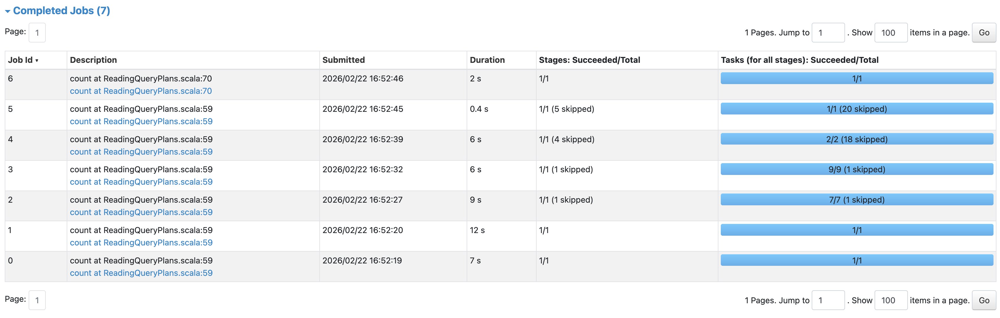

스파크(Spark) 강의를 보다가 어떤 두가지 df를 repartition(7), repartition(9)으로 만든 후 join을 시도하는 예제를 봤다. 성능과 관련없이 repartition할 때와 join할 때에 어떤 explain()이 이루어지는지 확인하는 예제였지만 실제로 join전에 repartition을 한 번 해준다면 비효율적인지 궁금해졌다.
또한 최적화를 위해 텅스텐 엔진과 카탈리스트에 대한 이해가 필요해 이 글에서 설명한다. 

---

## 1. 조인(Join) 전 Repartitioning, 과연 성능에 도움이 될까?

1,000만 건의 데이터와 2,000만 건의 데이터를 조인(Join)해야 하는 상황을 가정해 보자. 이때 "조인 전에 미리 `repartition(10)` 정도로 파티션을 잘게 또는 균등하게 쪼개두면 병렬 처리가 잘 돼서 빠르지 않을까?"라고 생각할 수 도 있겠다.

아래와 같은 상황에서 repartition은 효율적일까?

```scala  
  val ds1 = spark.range(1, 10000000)
  val ds2 = spark.range(1, 20000000, 2)
  val ds3 = ds1.repartition(7)
  val ds4 = ds2.repartition(9)
  val ds5 = ds3.selectExpr("id * 3 as id")
  val joined = ds5.join(ds4, "id")
  val sum = joined.selectExpr("sum(id)")
  sum.explain()
```

직접 실행해본 결과 리파티션 코드를 빼고 join해보니 속도가 단축되었다.



결론은 **특별한 목적(Join Key 기반의 파티셔닝)이 없다면 조인 전의 단순한 repartition()은 성능을 높여주지 않는다.(오히려 낮아진다.)**


### 조인과 셔플 파티션의 관계
스파크에서 두 데이터를 조인할 때는 반드시 **셔플(Shuffle)** 이 발생한다. 스파크는 같은 조인 키(Key)를 가진 데이터를 같은 파티션(노드)으로 모으기 위해 데이터를 네트워크 너머로 재분배하는데, 이때 기본적으로 `spark.sql.shuffle.partitions` 설정값(기본값 200)에 따라 데이터를 200개의 파티션으로 쪼갠다.

만약 조인 전에 `repartition(10)`을 한다면 스파크는 다음과 같이 동작한다.
1. 아무런 기준 없이 라운드 로빈(Round-Robin) 방식으로 데이터를 10개의 파티션으로 섞는다. **(1차 셔플 발생 - 네트워크 I/O 낭비)**
2. 조인 연산을 만나면 조인 키를 기준으로 다시 데이터를 200개의 파티션으로 섞는다. **(2차 셔플 발생)**

즉, 의미 없는 셔플을 한 번 더 유발하여 성능만 떨어뜨리게 된다. **어차피 조인이 발생하면 스파크가 알아서 조인 키를 기준으로 200개로 리파티셔닝을 해주기 때문에, 스파크 엔진을 믿고 그대로 조인하는 것이 가장 빠르다.**

---

## 2. API별 극단적 성능 차이: 직렬화(Serialization)

같은 10억 건의 데이터를 세는(`count()`) 작업인데, 왜 API에 따라 16초가 걸리기도 하고 0.1초 만에 끝나기도 할까? 아래 코드를 통해 원인을 분석해 본다.

```scala
val sc = spark.sparkContext
// 1. RDD를 생성하고 DataFrame으로 변환 후 Count
val rdd = sc.parallelize(1 to 1000000000)
val df = rdd.toDF("id")
df.count() // 약 16초 소요 (매우 느림)

// 2. 처음부터 Dataset/DataFrame으로 생성 후 Count
val ds = spark.range(1, 1000000000)
ds.count() // 0.1초 소요 (매우 빠름)
```

### 16초 vs 0.1초 차이 나는 이유
* `sc.parallelize`를 사용하면 10억 개의 무거운 `java.lang.Integer` **JVM 객체** 가 메모리(Heap)에 생성된다. 이를 DataFrame으로 변환(`toDF`)하려면, 스파크는 10억 개의 객체를 일일이 꺼내서 스파크의 내부 바이너리 포맷으로 **직렬화(SerializeFromObject)** 하는 엄청난 노가다를 해야 한다. 이 변환 비용이 16초나 걸린 것이다.
* 반면 `spark.range`는 애초에 JVM 객체를 만들지 않는다. 처음부터 텅스텐(Tungsten) 엔진이 좋아하는 바이너리 포맷으로 메모리에 데이터를 밀어 넣기 때문에 0.1초 만에 연산이 끝난다.


### 람다(Lambda) 함수
Dataset은 빠르지만, 스칼라의 익명 함수(람다)를 쓰게되면 성능 저하가 일어난다.

```scala
// DS의 각 요소에 5를 곱하는 연산
val dsTimes5 = ds.map(_ * 5)
dsTimes5.selectExpr("count(*)").show() // 갑자기 7초로 느려짐 (70배 증가)
```

실행 계획(`explain()`)을 보면 이유를 명확히 알 수 있다.
스파크 엔진 입장에서 `_ * 5` 라는 스칼라 코드는 속을 알 수 없는 블랙박스다. 최적화된 바이너리 데이터를 연산하기 위해 어쩔 수 없이 다시 JVM 객체로 **역직렬화(DeserializeToObject)하고,** 연산이 끝나면 다시 **직렬화(SerializeFromObject)해야** 한다. 

**💡 해결방법:** 가능하면 `ds.map(_ * 5)` 대신, 스파크가 이해할 수 있는 컬럼 표현식인 `df.select($"id" * 5)`를 사용하면 직렬화 비용 없이 텅스텐 엔진으로 처리되기 때문에 결과는 같지만 직렬화 과정 없이 즉시 연산된다. 한 번 DataFrame을 선택했다면 끝까지 DataFrame의 DSL(내장 함수)을 유지하는 것이 핵심이다.

---

## 3. 텅스텐(Tungsten) 엔진과 Whole-Stage CodeGen

텅스텐(Tungsten)은 JVM의 한계를 극복하고 하드웨어(CPU, 메모리)의 성능을 극한까지 끌어올리기 위한 스파크의 핵심 엔진이다. 텅스텐 엔진이 발동되는 가장 대표적인 최적화 기술이 바로 **전체 스테이지 코드 생성(Whole-Stage Code Generation)이다.**

아래 코드를 통해 텅스텐 엔진을 껐다 켰을 때의 차이를 살펴보자.

```scala
// 1. 텅스텐 엔진 강제 끄기
spark.conf.set("spark.sql.codegen.wholeStage", "false")
val noWholeStageSum = spark.range(1000000).selectExpr("sum(id)")
noWholeStageSum.explain()
/*
== Physical Plan ==
HashAggregate(keys=[], functions=[sum(id#54L)])
+- HashAggregate(keys=[], functions=[partial_sum(id#54L)])
   +- Range (0, 1000000, step=1, splits=1)
*/

// 2. 텅스텐 엔진 켜기 (기본값)
spark.conf.set("spark.sql.codegen.wholeStage", "true")
val wholeStageSum = spark.range(1000000).selectExpr("sum(id)")
wholeStageSum.explain()
/*
== Physical Plan ==
*(1) HashAggregate(keys=[], functions=[sum(id#67L)])
+- *(1) HashAggregate(keys=[], functions=[partial_sum(id#67L)])
   +- *(1) Range (0, 1000000, step=1, splits=1)
*/
```

### 실행 계획의 별표(`*`)가 의미하는 것
텅스텐 엔진을 켜고 `explain()`을 호출하면 노드 앞에 `*(1)` 이라는 별표가 붙는다. 이것이 바로 **Tungsten이 개입하여 Whole-Stage CodeGen이 적용되었다는 표시이다.**


---

## 4. 카탈리스트(Catalyst): 쿼리 플랜 최적화

텅스텐이 물리적인 연산 속도를 높인다면, **카탈리스트(Catalyst) 옵티마이저**는 쿼리의 논리적인 구조 자체를 가장 효율적인 경로를 찾아준다.

```scala
val flights = spark.read.option("inferSchema", "true").json("src/main/resources/data/flights")

// 의사소통 부재로 인해 똑같은 데이터를 필터링하는 중복 코드가 발생한 상황
def filterTeam1(flights: DataFrame) = flights.where($"origin" =!= "LGA").where($"dest" === "DEN")
def filterTeam2(flights: DataFrame) = flights.where($"origin" =!= "EWR").where($"dest" === "DEN")

val filterBoth = filterTeam1(filterTeam2(flights))
filterBoth.explain(true)
```
여러 개발자가 협업하다 보면 위처럼 비효율적인 필터링(`where`)이 중첩될 수 있다. 하지만 카탈리스트는 물리적 실행 계획을 짜기 전에 이 논리들을 분석하여 **중복을 제거하고 조건들을 하나의 깔끔한 식으로 합쳐준다.**


### 파티션/필터 푸시다운 (Pushdown)
카탈리스트의 가장 무서운 점은 소스(Parquet 등)에서 데이터를 읽을 때 발휘된다.

```scala
val notFromLGA = spark.read.load("src/main/resources/data/flights_parquet")
  .where($"origin" =!= "LGA")
```
이 코드를 실행하면, 스파크는 메모리에 데이터를 다 올려놓고 필터링을 하는 것이 아니라, **디스크(Parquet)에서 데이터를 읽어 들일 때부터 이미 "LGA"가 아닌 데이터만 골라서 읽어온다.** 이를 필터 푸시다운(Filter Pushdown)이라고 하며, 불필요한 I/O를 원천 차단하여 성능을 기하급수적으로 높여준다.

---

## 📝 최종 결론 (Best Practices)
1. 조인 연산 전 의미 없는 `repartition()`은 성능저하를 불러올 수 있다.
2. 스파크 코드를 짤 때는 무거운 객체를 만드는 RDD나 `ds.map()` 같은 람다 함수 사용을 피하고, 가급적 **DataFrame의 내장 함수(DSL)를** 사용해 직렬화를 피하는 것이 최적화 팁이다.
3. 스파크는 텅스텐(Whole-Stage CodeGen)과 카탈리스트(Pushdown)라는 빠른 자체 엔진을 가지고 있다. 불필요햐게 직렬화를 하지 않고 텅스텐 엔진을 최대한 활용하는 코드 작성하는 것이 필요하다.