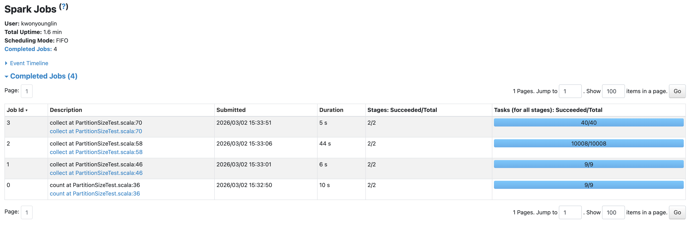

Apache Spark에서 데이터 파티셔닝(Partitioning)은 분산 처리 성능을 결정짓는 가장 핵심적인 요소이다. 파티션의 개수와 분배 방식에 따라 셔플(Shuffle) 통신 비용이 기하급수적으로 달라지며, 잘못된 설정은 OOM(Out of Memory)이나 디스크 스필(Spill)을 유발한다.

본 문서에서는 Spark 애플리케이션 개발 시 성능 병목을 유발하는 파티셔닝 문제를 파악하고, 코드를 통한 최적화 전후의 차이를 두 가지 예제를 통해 알아본다.

---

## 1. 필터링 후 파일 저장 시: Repartition vs Coalesce

대규모 데이터를 필터링하여 극소수의 데이터만 남긴 후, 이를 스토리지(Parquet, Iceberg 등)에 저장하는 상황을 가정한다. 필터링 직후에는 데이터 양은 줄어들지만 기존 파티션 개수는 그대로 유지되므로, 내부에 데이터가 거의 없는 '빈 파티션(Empty Partition)'이 다수 존재하게 된다. 
이를 적절한 개수로 줄여서 저장해야 Small File Problem을 방지할 수 있는데, 이때 파티션을 병합하는 방식에 따라 성능 차이가 극명하게 발생한다.

### ❌ 적용 전: `repartition()` 사용 (네트워크 병목 발생)
`repartition()`은 데이터를 지정한 파티션 수에 맞게 균등하게 재분배하기 위해 클러스터 전체 노드 간에 셔플(Shuffle)을 강제 발생시킨다.

```scala
val hugeDF = spark.range(1, 1000000000, 1, 10000)
// 강력한 필터링 적용 (데이터 99% 제거)
val filteredDF = hugeDF.filter($"id" % 100000 === 0)

// 파티션 수를 10개로 줄이기 위해 repartition 사용 (비효율적)
// 전체 노드 간 셔플(네트워크 I/O 및 직렬화/역직렬화)이 발생하여 속도가 매우 느리다.
filteredDF.repartition(10).write.parquet("output/slow_write")
```

### ✅ 적용 후: `coalesce()` 사용 (로컬 병합)
`coalesce()`는 셔플을 유발하지 않고, 동일한 익스큐터(Executor) 노드 내에 존재하는 파티션들을 물리적으로 병합(Merge)만 수행한다.

```scala
val hugeDF = spark.range(1, 1000000000, 1, 10000)
val filteredDF = hugeDF.filter($"id" % 100000 === 0)

// 파티션 수를 줄일 때는 coalesce 사용 (최적화)
// 네트워크 셔플 통신 비용이 0이므로 즉시 파일 쓰기 작업이 완료된다.
filteredDF.coalesce(10).write.parquet("output/fast_write")
```

**📌 결론:**
데이터의 파티션 개수를 줄여야 하는 상황(특히 필터링 직후 파일 쓰기)에서는 무의미한 셔플을 유발하는 `repartition`을 피하고, 반드시 `coalesce`를 적용하여 셔플 통신 비용을 제거해야 한다.

---

## 2. 대규모 셔플 연산 시: Shuffle Partitions 동적 조정

`groupBy`나 `join`과 같은 넓은 의존성(Wide Dependency) 연산을 수행할 때, Spark는 기본적으로 `spark.sql.shuffle.partitions` 설정값인 200개의 파티션으로 데이터를 섞는다. 
셔플 데이터의 총량이 클 때 기본값을 그대로 사용하면, 파티션 1개당 할당되는 데이터 크기가 익스큐터의 처리 메모리(Execution Memory) 한계를 초과하여 디스크 스필(Spill)이 발생하고 성능이 심각하게 저하된다.

최적의 파티션 크기는 10~100MB 사이이며, 최대 200MB를 넘지 않도록 설정해야 한다. 아래에 세가지 케이스를 통해 실행시간을 비교해본다.

```scala
    // =======================================================
    // Case 1: 극단적 거대 파티션 (파티션 2개)
    // - 파티션당 크기: 약 750MB (권장치 200MB 초과)
    // - 문제점 1: 코어가 8개인데 태스크가 2개뿐이라 6개 코어가 유휴(Idle) 상태가 됨
    // - 문제점 2: 메모리 부족으로 디스크 Spill 발생 가능성 높음
    // =======================================================
    spark.conf.set("spark.sql.shuffle.partitions", "1")
    val time1 = time {
      df.groupBy("key").agg(count("*"), max("payload1")).collect()
    }
    println(s"[Case 1] 거대 파티션(2개) 소요 시간: ${time1 / 1000.0} 초")

    // =======================================================
    // Case 2: 극단적 미세 파티션 (파티션 10,000개)
    // - 파티션당 크기: 약 150KB (권장치 10MB 미달)
    // - 문제점: 데이터를 처리하는 시간보다 10,000개의 태스크를 생성, 할당, 회수하는
    //         네트워크 및 스케줄링 오버헤드 시간이 훨씬 오래 걸림
    // =======================================================
    spark.conf.set("spark.sql.shuffle.partitions", "10000")
    val time2 = time {
      df.groupBy("key").agg(count("*"), max("payload1")).collect()
    }
    println(s"[Case 2] 미세 파티션(10000개) 소요 시간: ${time2 / 1000.0} 초")

    // =======================================================
    // Case 3: 최적 파티션 (파티션 32개)
    // - 파티션당 크기: 약 46MB (10~100MB 스위트 스팟)
    // - 이점 1: 코어 8개가 각각 4번씩 태스크를 처리하여 CPU 100% 활용
    // - 이점 2: 메모리 스필 없이 안정적이고 빠른 셔플 정렬 수행
    // =======================================================
    spark.conf.set("spark.sql.shuffle.partitions", "32")
    val time3 = time {
      df.groupBy("key").agg(count("*"), max("payload1")).collect()
    }
    println(s"[Case 3] 최적 파티션(32개) 소요 시간: ${time3 / 1000.0} 초")
```



결과는 셔플 파티션이 1만개로 너무 많아졌을 때 오버헤드로 인해 44초가 걸리고, 1개 혹은 32개정도로 줄였을 때는 5, 6초가 걸렸다. 로컬환경이라 더 큰 데이터로 비교하기가 어렵지만, 데이터가 더 커서 셔플 파티션이 적은 상황에 데이터가 커지고 spill이 일어나다보면 셔플 파티션이 적은것 또한 병목이 생겨 속도에 영향을 줄 것으로 예상된다. 최적의 파티션을 찾는것이 중요하다.  